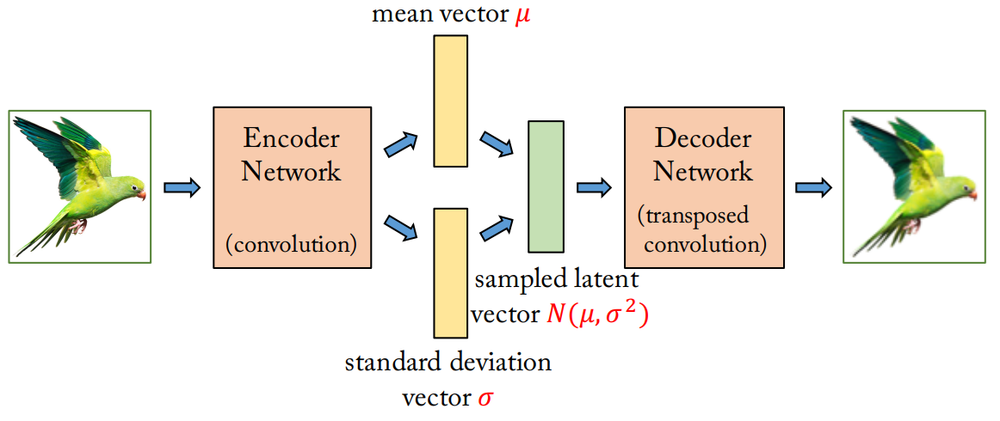
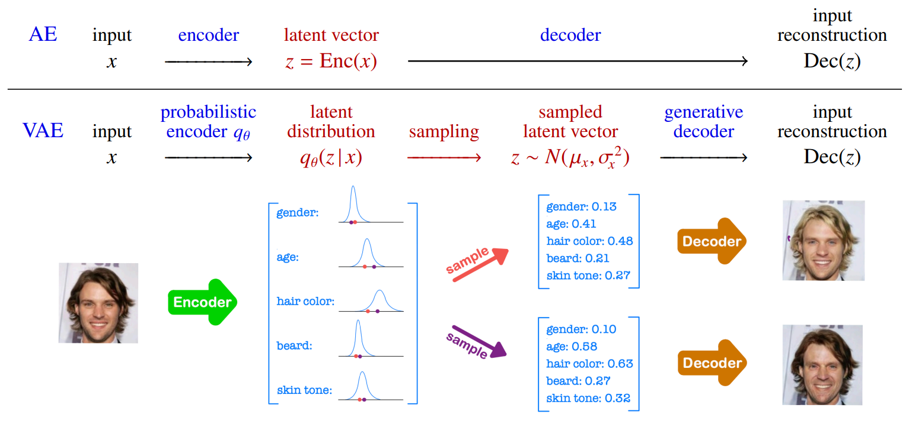
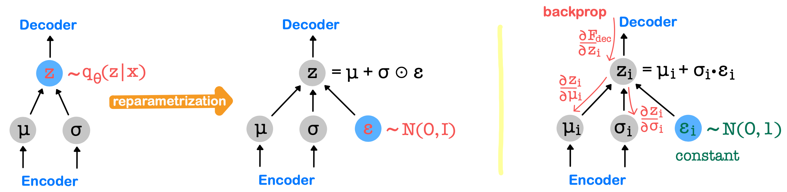
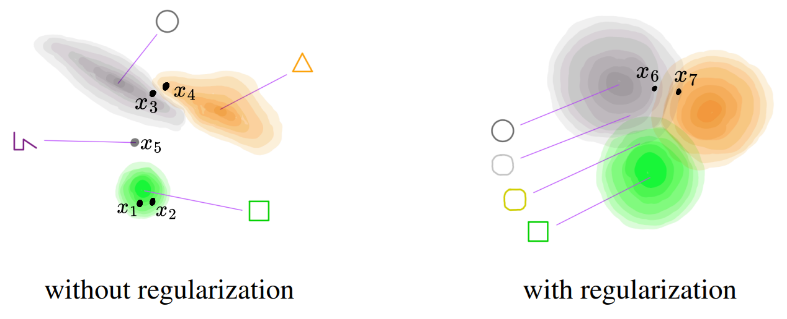
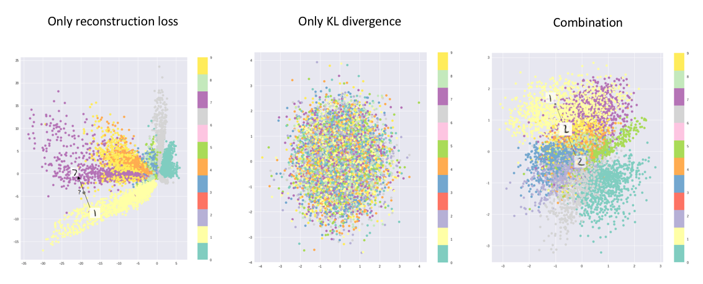

## 참고자료
* [1] [오승상 딥러닝 Deep Learning 36 Variational AE 1](https://youtu.be/yfxytn0OAAg?si=Fpdoyeuzg-8JNTnJ)
* [2] [오승상 딥러닝 Deep Learning 37 Variational AE 2](https://youtu.be/bKzN-k4lMRI?si=LUbzvAf0xk53lnwL)
* [3] [오승상 딥러닝 강의자료](https://sites.google.com/view/seungsangoh)

# Variational Auto-Encoder (VAE)

{: width="80%" height="80%" class="align-center"}

 (image source : 오승상 딥러닝 강의자료 p.154) 

* 새로운 모델을 생성할 수 있는 generative model이다.
* 하나의 latent vector를 만들어내는 것이 아니라 mean  $\mu$, standard deviation $\sigma$ 2개의 latent vector를 만들어낸다. 궁극적으로 그것을 통해 Gaussian distribution $N(\mu, \sigma^2)$를 만들낸다.
* AE에서는 각 attribute마다 single value를 만들면 된다. VAE에서는 각 attribute마다 posterior distribution $p(z \vert x)$를 만들려 한다.
  * input $x$이 주어졌을 때 $z$값에 대한 분포를 만들려고 한다. 하지만 posterior distribution을 직접 계산하는 것은 불가능에 가깝다.
  * input에 대해서 input들을 잘 표현할 수 있는 latent vector의 attribute(z값)들이 input값들을 잘 표현하기 위해서는 z에 대한 분포가 복잡할 수밖에 없다.(이것을 찾는 것은 불가능)
  * 따라서 gaussian으로 approximation하게 된다.(Variational inference)
* latent space 를 distribution으로 표현하게 되면 해당 distribution에서 sampling이 가능해진다. (해당 분포를 따르는 샘플 여러개를 만들어낼 수 있다.)
* decoder는 sample들에 대해서 reconstruct하게 된다.
* 이럴 경우 한 input에 대해 각기 다른 여러 개의 reconstructed output이 나온다.
* VAE의 목적은 input과 유사한 많은 데이터들을 생성할 수 있게 하는 것이다.
* (probabilistic encoder + generative decoder)

기존의 새로운 데이터를 만들기 위한 방법

* input data 변화 (data augmentation)
  * 픽셀 단위의 변화 (ex. crop, zoom, rotation, ...)
* AE의 latent vector 변화
  * feature의 변화 (ex. 사람 얼굴에서 age, gender, ... 등의 feature를 변경)
  * 어떤 값을 어떻게 얼마나 바꿔야할지를 알 수 없어 위험한 방법이다.

{: width="80%" height="80%" class="align-center"}

 (image source : 오승상 딥러닝 강의자료 p.155) 

* single point z를 만들어내는 것이 아니라 posterior distribution을 만들어내고 싶어한다. 하지만 이는 단순한 분포가 아니기에 상당히 복잡하다(intractable). 따라서 정규분포 variational posteriror $q_\theta(z \vert x)$로 근사한다(Variational Inference).
* normal distribution을 approximation 한다는 것은 평균과 표준편차를 찾아낸다는 뜻이다. 우리는 네트워크 $\theta$를 통해 평균 $\mu$와 표준편차 $\sigma$를 찾는다.
* probabilistic encoder $q_\theta$를 통과한 x는 latent distribution을 만들어내는데 이것은 $N(\mu_x, \sigma_x^2)$을 나타낸다. 그렇다면 encoder가 $\mu_x, \sigma_x$를 output으로 꺼내면 된다. 이 분포에서 $z \sim N(\mu_x, \sigma_x)$를 sampling하고 샘플링된 값 기반의 latent vector를 사용해서 input reconstruction을 한다.
* VAE의 latent space는 feature마다 확률분포를 나타내는 space를 가진다.
* input x가 encoder를 통과하면 해당 input에 대한 평균 $\mu$와 표준편차 $\sigma$를 만들어내는데 평균과 표준편차는 직접 계산하는 것이 아니라 평균과 표준편차를 나타내는 값을 네트워크가 만들어낸다.
* 평균과 표준편차가 나타내는 Normal Distribution $N(\mu_x, \sigma_x^2)$이 posteiror distribution $p(z \vert x)$를 잘 approximation할 수 있도록 평균과 표준편차를 만들어내도록 학습한다. 즉 데이터의 평균과 표준편차를 직접 계산하지 않는다.

encoder가 단순히 latent space를 만들기 위해 $\mu, \sigma$를 출력하게 하는 것은 잘 작동하지 않는다. 우리는 $N(\mu, \sigma^2)$에서 샘플링 된 값으로 decoder를 통과시켜 output을 만든다. 그런데 이 output이 input과 최대한 유사하게 하게 만들려고 한다. 그렇다면 $\mu$는 기존 AE의 z값과 같은 값으로 바로 만들려고 하고 편차 $\sigma$는 0으로 만든다. 이 때 output은 input과 유사하게 된다.

하지만 우리의 목적은 latent space의 distribution을 통해서 sampling을 다양하게 해서 여러가지 데이터를 생성하려는 것이 목적이다. 하지만 표준편차가 0이 되면 거의 z값과 비슷한 값만 나오기 때문에 sampling이 의미가 없어진다.(=다양한 output을 만들 수 없다.) 따라서 표준편차 $\sigma$의 값을 어느 정도 이상으로 유지하기 위해 기존의 Loss function에 다른 요소가 더 붙는다.

**목적**
* reconstruction error $L(\hat{y}, x) = \frac{1}{2}\sum_i(\hat{y}_i - x_i)^2$ 최소화 (기존 AutoEncoder의 Loss function)
* 표준편차 $\sigma$가 0으로 가는 것을 막기 위해, $q_{\theta}(z \vert x) \sim N(\mu_x, \sigma_x^2)$의 $N(\mu_x, \sigma_x^2)$ 분포가 $N(0, 1)$을 따르도록 한다. 이를 regularization term이라고 한다. 이것은 latent layer에서만 적용된다. 따라서 regularity를 만족하게 된다.

**Loss function**
$$L(\hat{y}, x) + \beta D_{\mathrm{KL}}(N(\mu_x, \sigma_x^2) \| N(0, I))$$

**Kullback-Leibler divergence**

$$\begin{align*}
&D_{\mathrm{KL}}(P \ \| \ Q) = \int_x p(x) \log \frac{p(x)}{q(x)}dx = \mathbb{E}_{x \sim P} \left[ \log \frac{p(x)}{q(x)} \right]   
\end{align*}$$

* 두 확률분포 $P, Q$가 비슷할 수록 KL Divergence가 낮아진다.
* $N(\mu_x, \sigma_x^2)$가 $N(0, I)$를 따르는 분포와 최대한 유사해지도록 한다.
  * 따라서 latent space의 regularity가 좋아지게 된다.
* (Reconstruction term) + (Regularization term)
  * $\beta$를 통해 두 term의 tradeoff를 조절한다.

**Implementation**
* $L(\hat{y}, x)$를 볼 때 AE에서는 $\hat{y}$를 계산하기 위해 differentiable function으로만 계산 했지만 VAE에서는 latent distribution에서 sampled latent vector를 얻기 위한 random sampling 과정이 포함된다. 하지만 random sampling은 differentiable function이 아니기에 backpropagation을 직접 사용할 수 없다.
* 따라서 위 문제를 해결하기 위해 reparameterization trick을 사용한다.
  * 원칙은 $N(\mu_x, \sigma_x^2)$를 사용하는 것이다. 하지만 여기서 직접 하지 않고 $N(0, I)$ 에서 $\epsilon$을 sampling한다. 그리고 sampled latent vector를 $z = \mu + \sigma \odot \epsilon$와 같이 계산한다.
    * $\epsilon$ : $N(0, I)$에서 sampling한 것이다.
    * $\sigma \odot \epsilon$ : 평균이 0이고 편차가 $\sigma$
    * $\mu + \sigma \odot \epsilon$ : 평균이 $\mu$, 편차가 $\sigma$인 분포
  * 즉 $\mu + \sigma \odot \epsilon$은 $N(\mu, \sigma)$에서 sampling한 것과 동일하다.

## Reparameterization trick

{: width="80%" height="80%" class="align-center"}

 (image source : 오승상 딥러닝 강의자료 p.157) 

* 연산에 random sampling이 포함될 경우 gradient를 계산할 수 없기 때문에 back propagation이 불가하다.
* 우리가 원하는 sample을 얻기 위한 분포는 $N(\mu_x, \sigma_x^2)$이다. 하지만 위에서 말한 것처럼 직접 sampling을 할 경우 gradient를 얻을 수 없기 때문에 $\epsilon \in N(0, I)$을 sampling한다. 여기서 다음과 같은 과정을 거친다.
  * $\sigma \odot \epsilon$ : 평균이 0이고 표준편차가 $\sigma$인 분포에서 sampling된 것과 같아진다.
  * $\mu + \sigma \odot \epsilon$ : 평균이 $\mu$이고 표준편차가 $\sigma$인 분포에서 sampling된 것과 같아진다.
  * 이렇게 될 경우 random sampling을 하는 것과 weight가 분리된다. 즉 $N(0, I)$에서 샘플링 하는데는 weight와 아무 관련이 없다.
* 왼쪽의 두 이미지의 파란색 부분은 random sampling 값을 뽑아내는 과정이다. 이 부분은 gradient가 존재하지 않는데 맨 왼쪽 그림의 경우 $\mu, \sigma$가 loss 까지 도달하기 위해 $z$ 부분을 거쳐야 한다. 하지만 가운데 그림의 경우 파란색 부분을 거치지 않아 gradient를 계산할 수 있고 backpropagation이 가능하다. 하지만 sampling에 대해서는 왼쪽과 동일한 결과를 가진다.
* 오른쪽 그림 : $\epsilon_i$는 상수취급하고 $\partial z_i / \partial \mu_i = 1$이고 $\partial z_i / \partial \sigma_i = \epsilon$이다.

## Regularization

{: width="80%" height="80%" class="align-center"}

 (image source : 오승상 딥러닝 강의자료 p.158) 

Latent space가 regularity를 잘 만족해야 generative process가 잘 이루어진다.
* Continuity
  * 수학에서 함수의 continuity와 비슷한 의미 
  * latent space는 어떤 input에 대해 encoder가 만들어낸 latent distribution이 있는 space를 말한다.
  * continuity : latent space의 두 개의 가까운 점을 decoder에 통과시켰을 때 완전히 다른 내용물이 나오면 안된다.
  * 왼쪽 그림에서 $x_1, x_2$을 디코더를 통과시키면 연두색 네모를 reconstruct하는 것으로 학습되어 있을 것이다.
  * 하지만 $x_3, x_4$는 가까이 있지만 디코더를 통과시키면 latent space에서 가까운데도 불구하고 회색 동그라미와 주황색 세모를 reconstruct하는 것으로 훈련되어 있을 것이다 이 경우 continuity가 적은 경우이다..
* Completeness
  * Completeness : $z \rightarrow \mathrm{Dec}(z)$ 처럼 latent space에서 추출된 $z$가 디코더를 통과하면 input 데이터에서 다루는 종류의 의미있는(meaningful) 데이터가 되어야 한다.
  * 예를 들어 $x_3$에서 reconstruct할 경우 회색 원모양을 만들어낼 것이다. 하지만 $x_5$ 를 선택할 경우 ○, △, □ 어떤 분포에도 속하지 않아 reconstruct하기 힘들다. 또한 decoder는 해당 데이터에 대해 학습해본 경험이 없기때문에 생성된 이미지는 기존 input과 매우다른 이미지가 나올 수 있다. 이 경우 completeness가 좋지 않다고 한다.

이러한 문제를 극복하기 위해 VAE에서는 loss function에 regularization term을 추가한다. 

**Loss function**
$$L(\hat{y}, x) + \beta D_{\mathrm{KL}}(N(\mu_x, \sigma_x^2) \| N(0, I))$$

* Regularization term : $D_{\mathrm{KL}}(N(\mu_x, \sigma_x^2) \| N(0, I))$
* Loss function은 줄여야 하는 것이고 $D_{\mathrm{KL}}$은 두 분포가 유사해야 값이 낮아지기 때문에 $\mu_x, \sigma_x$를 $0, 1$에 가깝도록 학습할 것이다.
  * covariance matrix 가 Identity matrix와 가깝도록 학습한다와 같은 말이다.
* $\sigma \rightarrow 1$ : 분포가 충분히 많은 공간을 커버하게 된다.
* $\mu \rightarrow 0$ : 평균이 0이 되도록 만든다.  
  * 물론 Reconstruction term $L(\hat{y}, x)$를 만족해야 하기 때문에 평균이 0이 되지는 않는다. 하지만 regularization term을 최소화하기 위해 0쪽으로 이동하게 된다.
  * 따라서 $x_3, x_4$가 가까운데도 불구하고 다른 결과를 reconstruct 했지만 $x_6, x_7$의 경우에는 비슷한 분포에 속하게 되어 비슷한 결과를 reconstruct하게 된다. 위에서 평균을 0에 가깝게 만든 결과이다.
  * 이 경우 interpolation도 유용하게 된다.

## Visualization of latent space

{: width="80%" height="80%" class="align-center"}

 (image source : https://www.jeremyjordan.me/variational-autoencoders/) 

* AE가 latent space를 만들고 input을 reconstruct하는 것은 생성모델에 좋지않다.
  * latent space가 irregular하다 : regularity가 좋지 않다, continuous가 잘 되지 않는다. 위 그림에서처럼 latent space에서 가까운데도 불구하고 생성되는 것이 많이 달라진다.
  * 또한 cluster 사이에 빈 공간이 많다. decoder가 올바른 그림을 그리기 힘든 공간. 해당 공간에 대해서는 학습이 제대로 되지 않았기 때문이다.
* KL Divergence만 사용할 경우 모든 분포의 평균이 0이 되기 때문에 어떤 점이 어떤 클래스에 속하는지 알기 굉장히 힘들어진다.
* reconstruction loss에 KL Divergence를 추가함으로써 continous and smooth latent space를 학습할 수 있다. 또한 cluster 사이의 공간이 작다.