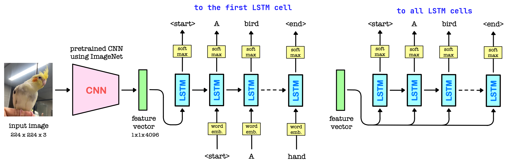
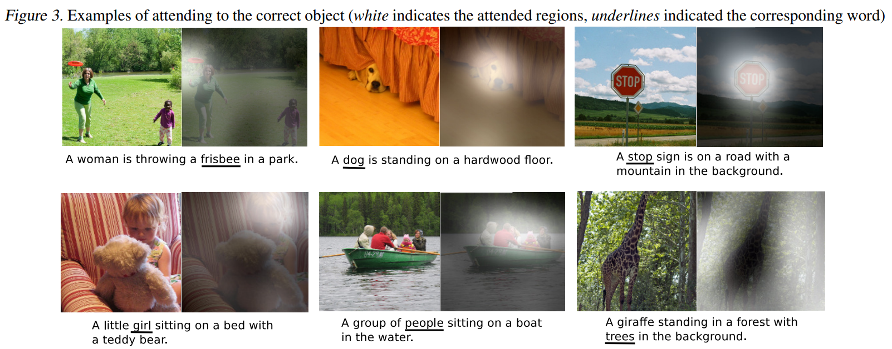
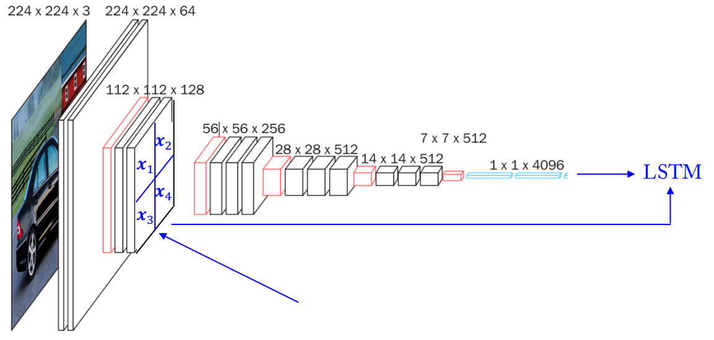
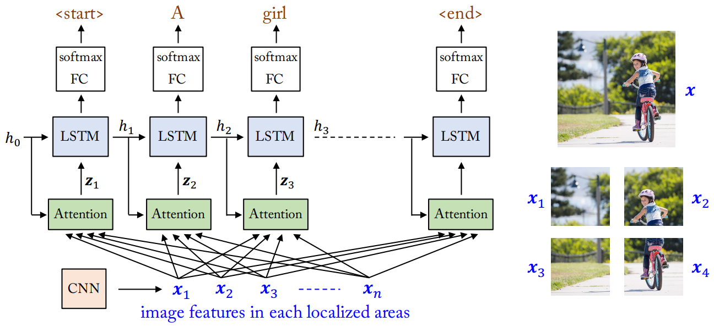

## 참고자료
* [1] [오승상 딥러닝 Deep Learning 32 Visual Attention](https://youtu.be/9RHb9B4cJso?si=92O-L2O7433wOuFb)
* [2] [오승상 딥러닝 강의자료](https://sites.google.com/view/seungsangoh)

## Attention

### CNN-LSTM

{: width="80%" height="80%" class="align-center"}

 (image source : 오승상 딥러닝 강의자료 p.135) 

* CNN-LSTM model for Image Captioning
  * Image Captioning : 이미지의 중요한 context를 찾아내서 문장으로 표현하는 것
  * CNN : 이미지에서 feature를 찾아냄 (encoder)
    * Pretrained CNN : 이미 학습된 CNN 모델(VGG-16 or Resnet)로 image captioning에 적용한다 
  * LSTM : Feature를 통해 text를 만들어냄 (decoder)
  * 기존에는 1000가지로 분류하기 위해 마지막에 1000개의 unit을 가진 레이어를 붙이지만 여기서는 분류하는 문제가 아니기 때문에 (1, 1, 1000) 레이어는 사용하지 않는다.
  * (1, 1, 4096)은 이미지의 정보를 feature vector로 압축해서 만든후에 LSTM에 집어넣는다.

{: width="80%" height="80%" class="align-center"}

 (image source : 오승상 딥러닝 강의자료 p.136) 

* LSTM은 feature vector를 text sequence로 decoding한다.
  * LSTM 입장에서는 initial input이 feature vector이다.
* feature vector를 LSTM에 넣는 방법
  * 맨 첫 LSTM Cell에만 집어넣기
    * hidden state가 feature vector의 정보를 잘 유지해야 올바른 text sequence를 generate 할 수 있을 것이다. hidden state의 크기가 크다면 학습이 매우 느려질 것이고 크기가 작다면 데이터가 많이 손실될 것이다.
  * 모든 LSTM Cell에 집어넣기.
    * 이미지 크기가 크면 정보의 손실을 줄이기 위해 매 LSTM 마다 feature vector를 입력한다.
* LSTM 모델은 문장을 시작한다는 신호로 start 의미를 갖는 \<start\> 토큰을 생성한다. (text sequence가 시작된다는 표시)
* 그 다음부터 (previous hidden state + previous output : $h_t=f(y_{t-1}, h_{t-1})$) 또는 (previous hidden state + feature vector : $h_t=f(x, h_{t-1})$)를 input으로 받아 매 단계마다 단어를 생성한다.
* 각 LSTM cell은 hidden state를 FC layer, softmax에 통과시켜 예측값을 출력한다.($y_t=g(h_t)$)
* 이미지가 커서 feature vector를 크게 해야 한다면 다음과 같은 문제가 있다.
  * feature vector를 맨 처음에 한번 입력하는 경우 hidden state 가 매우 클 것이다.
  * feature vector를 매번 입력하는 경우 매 input size가 매우 클 것이다.
  * 위와 같이 LSTM cell 에 입력되는 데이터가 매우 클 경우 학습이 잘 되지 않는다.

### Visual Attention

사람이 이미지를 인식할 때는 이미지 전체를 보는 것이 아니라 부분적인 곳만 본다.

{: width="80%" height="80%" class="align-center"}

 (image source : Show, Attend and Tell: Neural Image Caption Generation with Visual Attention) 

* 첫 번째 그림
  * A ___ : 사람 부분을 집중적으로 볼 것이다.
  * A woman is throwing a ___ : 에서 밑줄 부분을 맞춰야 한다면 하얀색으로 된 부분을 집중적으로 보는 것이 유리할 것이다.
  * A woman is throwign a frisbee in a ___ : 부분을 맞춘다면 배경부분을 보면서 park를 예측할 것이다.
* 세 번째 그림
  * A stop ___ : STOP을 관심있게 보면 그것이 sign이라는 것을 알 수 있을 것이다

이렇게 필요할 때 해당 부분을 집중해서 보는것을 attention이라 한다.

그럼 어느 곳을 봐야 할지를 어떻게 알 수 있을까?

{: width="80%" height="80%" class="align-center"}

 (image source : 오승상 딥러닝 강의자료 p.138) 

이전에는 $h_t=f(x, h_{t_1})$와 같이 되어있던 것을 $h_t = f(\mathrm{attention}(x, h_{t-1}), h_{t-1})$ 와 같이 attention moduel를 사용한다. attention은 input으로 들어갈 feature vector $x$와 previous hidden state $h_{t-1}$를 가지고 결정한다. 하지만 이때 기존의 x를 사용하는 것이 아니라 input image를 작은 size의 이미지로 잘라서 잘라진 조각(localized area)들에 대한 image feature map을 사용해서 작업한다.

standard LSTM에서는 $h_t=f(x, h_{t_1})$ LSTM의 input feature 로 $x$를 썼는데 이것은 pretrained CNN에서의 FC layer output 이었다. 그런데 우리는 이미지의 특정한 부분을 바라보고 싶어 한다. 즉, spatial information을 알아야한다 하지만 FC Layer에서는 spatial information이 사라진 상태이다. 여기에는 attention을 적용할 수 없다. attention은 어느 부분에 집중해야 할지를 결정하는 것이기 때문이다.

때문에 공간 정보를 가지고 있는 feature vector를 만들어야 한다. 따라서 CNN의 중간($x_1, x_2, x_3, x_4$라 적힌 부분)정도 오게 되면 이 부분에 대한 feature는 이미지에 대한 정보도 어느 정도 가지고 있고 공간정보도 어느 정도 가지고 있게 된다.

따라서 앞쪽의 CNN에서 feature map을 선택하고 n조각을 낸다. 해당 조각은 각 부분이 커버하는 부분의 feature와 위치정보를 가지고 있게 된다. 그리고 각 n조각을 끝까지 통과시켜 각 부분의 feature vector를 얻는다.

{: width="80%" height="80%" class="align-center"}

 (image source : 오승상 딥러닝 강의자료 p.139) 

이전에는 각 LSTM 마다 feature vector $x$를 집어넣었는데 이제는 훨씬 작은 사이즈의 $z_i$를 집어넣는다.

오른쪽 그림의 분할하여 CNN을 통과시켜서 이전에는 $x$를 얻었는데 이것을 $x_1, x_2, x_3, x_4$로 각 조각에 대한 feature vector를 얻는다. (image features in each localized areas) 따라서 localized area에서만 feature를 찾기 때문에 dimension을 작게 해도 무리가 없다.

* Soft attention, soft : (0, 1) 
  * image feature $x$ 대신 weighted image feature라고 하는 $g_t$가 LSTM의 input으로 들어오게 된다.
    * weighted feature : 여러개의 image feature에 weight를 줘서 sum을 한다.
    * $z_t$인 것은 매 time step 마다 weight를 주는 방법이 계속 바뀐다는 뜻이다. (각 부분마다 출력할 단어가 다르기 때문)
      * $z_t$를 결정하는데 사용될 weight가 무엇이냐에 따라 attention 모델의 성능을 좌우한다.
    * $z_t = \mathrm{attention}(x, h_{t-1})$
      * 여기서 $x$는 전체 $x$ set를 말한다. ($x_1, x_2, ..., x_n$)
  * $a_{ti}=f_{\mathrm{att}}(x_i, h_{t-1})$
    * previous hidden state $h_{t-1}$를 참고해서 어떤 $x$를 중요시 해야 할 지를 학습한다.
    * $a_{ti}$ : $t$에서 $x_i$가 중요한 정도
    * $f_{\mathrm{att}}$는 MLP를 사용하기도 한다. 예를 들어 아래와 같은 방법이 있다.
      * $a_{ti} = \tanh (Wh_{t-1}+W'x_i)$
      * $h_{t-1}Wx_i$
  * $z_t = \sum_{i=1}^n \alpha_{ti} x_i$
    * 안정적으로 값을 만들기 위해 가중치를 스케일링한다
    * $(\alpha_{t1}, ..., \alpha_{tn}) = \mathrm{softmax}(a_{t1}, ..., a_{tn})$
    * $0 < \alpha_{ti} < 1$
    * $\sum_i \alpha_{ti}=1$
    * $z_t$는 이전 $h_{t-1}$이 어떻게 됐냐에 따라 다른 값을 가지므로 $t$에 depend한 값이 된다.
  * Differentiable (trained by Backpropagation)
  * deterministic sampling
* Hard attention, hard : {0, 1}
  * attention weight를 확률로 사용한다.
  * $p(s_{ti}=1 \vert s_{j < t}, x)$ 즉 $s_{ti}$가 1일 확률이 $\alpha_{ti}$라는 것이다.
  * $z_t = \sum_{i=1}^n s_{ti} x_i \text{ where } p(s_{ti}=1 \vert s_{j < t}, x)=\alpha_{ti} \text{ with } s_{ti}=\{0, 1\}$ 
  * Non-differentiable (trained by REINFORCE)
  * stochastic sampling