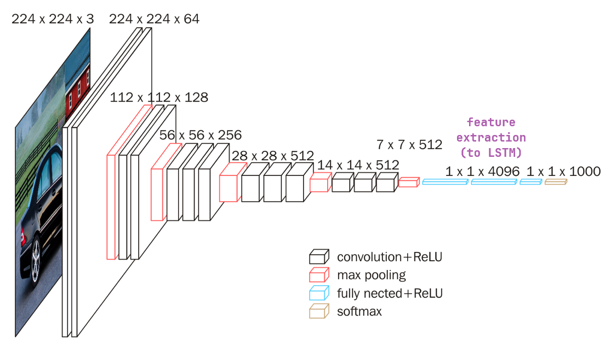

## 참고자료
* [1] [오승상 딥러닝 Deep Learning 32 Visual Attention](https://youtu.be/9RHb9B4cJso?si=92O-L2O7433wOuFb)
* [2] [오승상 딥러닝 Deep Learning 33 Attention LSTM](https://youtu.be/0aMn_-XQ6xw?si=XsigAH0sp5nnkqmA)
* [2] [오승상 딥러닝 강의자료](https://sites.google.com/view/seungsangoh)

## Attention

### CNN-LSTM

{: width="80%" height="80%" class="align-center"}

 (image source : 오승상 딥러닝 강의자료 p.135) 

* CNN-LSTM model for Image Captioning
  * Image Captioning : 이미지의 중요한 context를 찾아내서 문장으로 표현하는 것
  * CNN : 이미지에서 feature를 찾아냄 (encoder)
    * Pretrained CNN : 이미 학습된 CNN 모델(VGG-16 or Resnet)로 image captioning에 적용한다 
  * LSTM : Feature를 통해 text를 만들어냄 (decoder)
  * 기존에는 1000가지로 분류하기 위해 마지막에 1000개의 unit을 가진 레이어를 붙이지만 여기서는 분류하는 문제가 아니기 때문에 (1, 1, 1000) 레이어는 사용하지 않는다.
  * (1, 1, 4096)은 이미지의 정보를 feature vector로 압축해서 만든후에 LSTM에 집어넣는다.

{: width="80%" height="80%" class="align-center"}

 (image source : 오승상 딥러닝 강의자료 p.136) 

* LSTM은 feature vector를 text sequence로 decoding한다.
  * LSTM 입장에서는 initial input이 feature vector이다.
* feature vector를 LSTM에 넣는 방법
  * 맨 첫 LSTM Cell에만 집어넣기
    * hidden state가 feature vector의 정보를 잘 유지해야 올바른 text sequence를 generate 할 수 있을 것이다. hidden state의 크기가 크다면 학습이 매우 느려질 것이고 크기가 작다면 데이터가 많이 손실될 것이다.
  * 모든 LSTM Cell에 집어넣기.
    * 이미지 크기가 크면 정보의 손실을 줄이기 위해 매 LSTM 마다 feature vector를 입력한다.
* LSTM 모델은 문장을 시작한다는 신호로 start 의미를 갖는 \<start\> 토큰을 생성한다. (text sequence가 시작된다는 표시)
* 그 다음부터 (previous hidden state + previous output : $h_t=f(y_{t-1}, h_{t-1})$) 또는 (previous hidden state + feature vector : $h_t=f(x, h_{t-1})$)를 input으로 받아 매 단계마다 단어를 생성한다.
* 각 LSTM cell은 hidden state를 FC layer, softmax에 통과시켜 예측값을 출력한다.($y_t=g(h_t)$)
* 이미지가 커서 feature vector를 크게 해야 한다면 다음과 같은 문제가 있다.
  * feature vector를 맨 처음에 한번 입력하는 경우 hidden state 가 매우 클 것이다.
  * feature vector를 매번 입력하는 경우 매 input size가 매우 클 것이다.
  * 위와 같이 LSTM cell 에 입력되는 데이터가 매우 클 경우 학습이 잘 되지 않는다.

### Visual Attention

사람이 이미지를 인식할 때는 이미지 전체를 보는 것이 아니라 부분적인 곳만 본다.

{: width="80%" height="80%" class="align-center"}

 (image source : Show, Attend and Tell: Neural Image Caption Generation with Visual Attention) 

* 첫 번째 그림
  * A ___ : 사람 부분을 집중적으로 볼 것이다.
  * A woman is throwing a ___ : 에서 밑줄 부분을 맞춰야 한다면 하얀색으로 된 부분을 집중적으로 보는 것이 유리할 것이다.
  * A woman is throwign a frisbee in a ___ : 부분을 맞춘다면 배경부분을 보면서 park를 예측할 것이다.
* 세 번째 그림
  * A stop ___ : STOP을 관심있게 보면 그것이 sign이라는 것을 알 수 있을 것이다

이렇게 필요할 때 해당 부분을 집중해서 보는것을 attention이라 한다.

그럼 어느 곳을 봐야 할지를 어떻게 알 수 있을까?

{: width="80%" height="80%" class="align-center"}

 (image source : 오승상 딥러닝 강의자료 p.138) 

이전에는 $h_t=f(x, h_{t_1})$와 같이 되어있던 것을 $h_t = f(\mathrm{attention}(x, h_{t-1}), h_{t-1})$ 와 같이 attention moduel를 사용한다. attention은 input으로 들어갈 feature vector $x$와 previous hidden state $h_{t-1}$를 가지고 결정한다. 하지만 이때 기존의 x를 사용하는 것이 아니라 input image를 작은 size의 이미지로 잘라서 잘라진 조각(localized area)들에 대한 image feature map을 사용해서 작업한다.

standard LSTM에서는 $h_t=f(x, h_{t_1})$ LSTM의 input feature 로 $x$를 썼는데 이것은 pretrained CNN에서의 FC layer output 이었다. 그런데 우리는 이미지의 특정한 부분을 바라보고 싶어 한다. 즉, spatial information을 알아야한다 하지만 FC Layer에서는 spatial information이 사라진 상태이다. 여기에는 attention을 적용할 수 없다. attention은 어느 부분에 집중해야 할지를 결정하는 것이기 때문이다.

때문에 공간 정보를 가지고 있는 feature vector를 만들어야 한다. 따라서 CNN의 중간($x_1, x_2, x_3, x_4$라 적힌 부분)정도 오게 되면 이 부분에 대한 feature는 이미지에 대한 정보도 어느 정도 가지고 있고 공간정보도 어느 정도 가지고 있게 된다.

따라서 앞쪽의 CNN에서 feature map을 선택하고 n조각을 낸다. 해당 조각은 각 부분이 커버하는 부분의 feature와 위치정보를 가지고 있게 된다. 그리고 각 n조각을 끝까지 통과시켜 각 부분의 feature vector를 얻는다.

{: width="80%" height="80%" class="align-center"}

 (image source : 오승상 딥러닝 강의자료 p.139) 

이전에는 각 LSTM 마다 feature vector $x$를 집어넣었는데 이제는 훨씬 작은 사이즈의 $z_i$를 집어넣는다.

오른쪽 그림의 분할하여 CNN을 통과시켜서 이전에는 $x$를 얻었는데 이것을 $x_1, x_2, x_3, x_4$로 각 조각에 대한 feature vector를 얻는다. (image features in each localized areas) 따라서 localized area에서만 feature를 찾기 때문에 dimension을 작게 해도 무리가 없다.

* Soft attention, soft : (0, 1) 
  * image feature $x$ 대신 weighted image feature라고 하는 $g_t$가 LSTM의 input으로 들어오게 된다.
    * weighted feature : 여러개의 image feature에 weight를 줘서 sum을 한다.
    * $z_t$인 것은 매 time step 마다 weight를 주는 방법이 계속 바뀐다는 뜻이다. (각 부분마다 출력할 단어가 다르기 때문)
      * $z_t$를 결정하는데 사용될 weight가 무엇이냐에 따라 attention 모델의 성능을 좌우한다.
    * $z_t = \mathrm{attention}(x, h_{t-1})$
      * 여기서 $x$는 전체 $x$ set를 말한다. ($x_1, x_2, ..., x_n$)
  * $a_{ti}=f_{\mathrm{att}}(x_i, h_{t-1})$
    * previous hidden state $h_{t-1}$를 참고해서 어떤 $x$를 중요시 해야 할 지를 학습한다.
    * $a_{ti}$ : $t$에서 $x_i$가 중요한 정도
    * $f_{\mathrm{att}}$는 MLP를 사용하기도 한다. 예를 들어 아래와 같은 방법이 있다.
      * $a_{ti} = \tanh (Wh_{t-1}+W'x_i)$
      * $h_{t-1}Wx_i$
  * $z_t = \sum_{i=1}^n \alpha_{ti} x_i$
    * 안정적으로 값을 만들기 위해 가중치를 스케일링한다
    * $(\alpha_{t1}, ..., \alpha_{tn}) = \mathrm{softmax}(a_{t1}, ..., a_{tn})$
    * $0 < \alpha_{ti} < 1$
    * $\sum_i \alpha_{ti}=1$
    * $z_t$는 이전 $h_{t-1}$이 어떻게 됐냐에 따라 다른 값을 가지므로 $t$에 depend한 값이 된다.
  * Differentiable (trained by Backpropagation)
  * deterministic sampling
* Hard attention, hard : {0, 1}
  * attention weight를 확률로 사용한다.
  * $p(s_{ti}=1 \vert s_{j < t}, x)$ 즉 $s_{ti}$가 1일 확률이 $\alpha_{ti}$라는 것이다.
  * $z_t = \sum_{i=1}^n s_{ti} x_i \text{ where } p(s_{ti}=1 \vert s_{j < t}, x)=\alpha_{ti} \text{ with } s_{ti}=\{0, 1\}$ 
  * Non-differentiable (trained by REINFORCE)
  * stochastic sampling

### Seq2Seq

{: width="80%" height="80%" class="align-center"}

 (image source : 오승상 딥러닝 강의자료 p.140) 

* 하나의 시퀀스에서 또다른 시퀀스로 보내는 framework
* Encoder LSTM (파란색 부분)
  * Input sentence에 있는 단어 하나하나를 input data로 받아들인다.
  * 각 단어를 벡터로 바꾼 후 그 벡터를 input으로 받아들인다. (word embedding)
  * 전체 input sentence 내용들은 small fixed-size vector로 압축된다.
  * 문장을 읽기만 하기 때문에 output을 만들 필요가 없다.
  * 단어를 이해하는 데 초점
* Decoder LSTM (초록색 부분)
  * small fixed-size vector(encoded vector)를 가지고 다른 언어의 문장을 생성한다.
  * 단어를 하나씩 생성한다.
  * hidden state에는 앞에 있는 모든 정보가 압축되어 있다. 이 정보를 끝까지 보내야 각 위치에 적절한 단어를 생성할 수 있다.
  * 생성된 단어는 다음 LSTM의 input으로 입력되어 hidden state와 함께 다음 단어를 생성한다.
  * $V$를 small fixed sized vector라고 하면 $V$는 input 문장 전체를 인코딩한 벡터가 된다.
  * $V$와 시작을 알리는 input를 가지고 첫 번째 hidden state $s_1$을 얻는다. 이 $s_1$을 가지고 output 단어를 예측한다. 그리고 그 output과 hidden_state $s_1$를 가지고 두번째 hidden_state $s_2$를 생성하고 $s_2$를 통해 두 번째 단어를 생성한다. 이를 반복하면 하나의 sequence가 만들어진다.
  * 단어를 생성하는 데 초점
* Encoder, Decoder는 각각의 목적이 다르기 때문에 다른 모델을 사용한다.
* fixed sized-vector 가 충분히 커야 입력된 문장의 정보를 모두 담을 수 있을 것이다. 하지만 크기가 너무 크면 LSTM에 통과하면서 속도가 느려질 것이다.
  * 읽어들인 문장의 문맥과 각 단어들을 잘 기억해야 새로운 문장을 잘 생성할 수 있을 것이다. 하지만 이것은 상당히 어렵다.
* 만약 $V$가 문맥과 각 단어에 대해 완벽하지 않고 간략하게 기억한 후 문장을 생성할 때 앞 부분의 단어를 다시 참고할 수 있다면 문제는 쉬워질 것이다. 하지만 현재 Seq2Seq는 앞의 정보를 다시 볼 수 없다.

### Attention LSTM

{: width="80%" height="80%" class="align-center"}

 (image source : 오승상 딥러닝 강의자료 p.141) 

* 기존 Seq2Seq의 가장 큰 bottleneck은 input sequence의 전체 내용을 small fixed-sized vector $V$로 압축을 해야 한다는 것이다. 때문에 상당히 많은 정보가 손실된다.
* Attention은 Decoder가 새로운 단어를 생성할 때 encoder의 hidden state를 참고한다.
  * query, key, value vector를 사용하여 hidden state들의 weighted average를 계산하고(차원이 낮아진다) encoder의 새로운 input으로 추가한다.
* 예를 들어 현재 time step에서 previous hidden state 를 $h_{t-1}$이라 하자, $h_{t-1}$과 oiseau를 가지고 단어 current output를 예측하려 한다. 
  * previous hidden state $h_{t-1}$ 에는 encoded vector에 있는 모든 정보들이 current time step까지 전달이 되어 있고, 이전단계까지 생성한 단어에 대한 정보도 들어있다. 그리고 그 다음에 어떤 단어가 나와야 될지에 대한 암시가 있을 것이다.
  * 그렇게 $h_{t-1}$를 통해서 앞을 살펴볼 것이다. 만약 다음에 생성할 단어가 목적어라면 앞의 문장에서 목적어에 해당되는 단어를 더 관심있게 볼 것이다.
* Decoder의 각 단계의 hidden state를 기준으로 해서 input sequence에서 관련한 단어들이 있을 것이다. 이 경우 해당 단어에 더 집중하여 번역하면될 것이다.
* 무엇을 attention해야 할지에 대한 기준이 되는 것은 decoder의 hidden state이다. 이를 기준으로 참고해야 할 단어를 기준잡는다. 이를 **query**라고 한다.
  * query : 각 decoder의 hidden state
* value vector : query에 의해 특별히 관심을 가져야 할 input sequence의 단어(specific word)들, 이를 **value**라고 한다.
  * specific word라고 하지만 실제로는 encoder의 각 timestep의 hidden state을 참고한다.
* key vector : 어느 단어를 주시해서 봐야할 지를 결정하는 것이 weight인데 이를 계산하기 위해 사용되는 vector
  * 이 경우 weight를 찾기 위해 동일하게 encoder의 hidden state를 사용해서 계산한다.
* key/value vector : encoder hidden state를 사용하는 vector이지만 더 복잡한 알고리즘의 경우 query, key, value vector가 정확히 3가지가 구분되어 있다.
* query vector($s_{t-1}$) : input sentence에서 어떤 단어들을 중요시 여겨야 할 지 요청하는 vector, decoder의 previous hidden state
* key vector($h_i$) : input sentece안에 있는 각 단어별로 weight를 어떻게 해야 할지 query의 요청에 의해서 weight를 정하기 위해 계산되어지는 vector
* value vector($h_j$)
* key / value vector 이 동일한 encoder hidden state를 사용한다.
* Seq2Seq 모델에서 previous hidden state값으로 query를 사용해서 encoder의 hidden state에 query를 각각 적용해서 weight들을 계산한다. 이 weight로 weighted average를 계산한다. weighted average도 hidden state를 기준으로 취한다. 그 후에 새로운 input을 집어넣고 output을 예측한다.
* 이와 같이 attention에서는 encoded vector 뿐만 아니라 앞의 sequence를 다시 참고하면서 decoder가 새로운 단어를 예측하여 효율을 훨씬 높인다.
* weight를 출력하면 어떤 단어를 중요시 여겼는지 볼 수 있다. 이것은 중요한 정보가 되기도 한다.

### Dot product attention

{: width="80%" height="80%" class="align-center"}

 (image source : 오승상 딥러닝 강의자료 p.142) 

* 다른 종류 attention
  * $s_{t-1}^T \cdot h_i$ : dot-prod
  * $s_{t-1}^T W h_i$ : general
  * $v^T \tanh (W [s_{t-1}; h_i])$ : concat
    * with learnable $W$ and $v$
* query : decoder의 previous hidden state
* key : encoder의 hidden state
* value : encoder의 hidden state

Transformer의 경우 Transformer 안에서 query, key, value가 정확히 구분된다.

visual attention에서

$$\alpha_{ti} = \mathrm{softmax}(f_{\mathrm{att}}(x_i, h_{t-1}))$$

* Deep Neural Network를 사용해서 $f_{\mathrm{att}}(x_i, h_{t-1})$를 계산한다. 그리고 softmax 를 계산하여 attention weight를 찾는다.
* 이때 참고했던 query는 previous hidden state $h_{t-1}$이다.
  * LSTM Attention에서는 $s_{t-1}^T$
* key vector는 $x_i$인데 localized area의 image feature vector이다.
  * LSTM Attention에서는 $h_i$로 이것은 encoder의 hidden state이다.

이와 같이 LSTM에서 Dot-product attention에서는 아래와 같이 계산된다.

* attention weight : $\alpha_{ti} = \mathrm{softmax}(s_{t-1}^T \cdot h_i)$
  * $t$ : decoder LSTM에서 현재의 time step
  * $i$ : encoder의 hidden state 각각
* attention value : $a_t = \sum_j \alpha_{tj} h_j$

Standard LSTM에서는 $s_t = f(s_{t-1}, y_{t-1})$ 와 같이 decoder의 previous hidden state와 previous output을 input으로 하여 current hidden state를 계산한다.

Attention LSTM에서는 $s_t = f(s_{t-1}, a_t, y_{t-1})$와 같이 attention value가 추가된다. 따라서 current hidden state을 더 정확히 얻어낼 수 있다.

decoder에서 previous hidden state $s_{t-1}$가 있다면 이것이 query이다. 이것을 가지고 각 hidden state과 dot product를 취한다. $s_{t-1}^T \cdot h_i$ 이로 인해 계산된 수는 실수일 것이다. 이때 중요한 단어에 해당되는 실수값이 크게 나올 것이다. 이는 softmax를 통해 (0, 1)의 값으로 바뀌며 이것이 attention weight가 된다. 

그리고 이 attention weight를 각 value vector $h_j$에 곱해준다. 이를 통해 만든 $a_t = \alpha_1 h_1 + \cdots + \alpha_n h_n$가 attention value가 된다.

이후 decoder에서의 previous hidden state인 $s_{t-1}$과 $s_{t-1}$을 기준으로 찾아낸 attention value $a_t$를 concatenation 한다. 그리고 그 값을 decoder의 current LSTM에 집어넣는다. 그러면 훨씬 더 좋은 hidden state값이 출력된다.

attention을 계산시 dot product모델을 사용할 경우 따로 학습할 weight가 없다. (non learnable) 성능을 높이고 싶다면 중간에 weight matrix를 추가하여 곱해주는 형태를 general model 이라 한다. ($s_{t-1}^T W h_i$) 이렇게 되면 weight matrix가 있기 때문에 더 좋은 값의 attention weight들을 출력할 수 있게 된다.

또는 $W$에 decoder의 previous hidden state과 encoder의 hidden state를 concatenation 한다. ($\tanh(W[s_{t-1}; h_i])$) 그럼 여기서 vector가 나오게 되는데 우리는 실수값을 원한다 따라서 이 앞에 learnable vector $v$를 곱해서 실수값을 만들 수도 있다.

{: width="80%" height="80%" class="align-center"}

 (image source : 오승상 딥러닝 강의자료 p.143) 

* Standard LSTM에서의 Seq2Seq에서는 input whole sentence를 하나의 hidden state으로 encoding 해야 했다. 이 hidden state의 dimension때문에 제약이 있었다.
* Attention에서는 각 단어를 생성하는 step에서 encoder의 input word들을 나타내는 hidden state를 다시 사용할 수 있었다. 따라서 더 정확한 단어를 예측할 수 있었다.
* Attention을 사용하면 위 그림과 같이 번역시 각 hidden state마다 어떤 단어들을 참고했는지 나타낼 수 있다.
  * 예를 들어 accord 단어를 생성할 때 가장 많이 attention한 단어는 agreement이다.
  * European Economic Area와 같이 영어는 앞에서 뒤를 수식했는데 불어에서는 zone economique europeenne로 뒤에서 앞을 수식하여 반대가 된다. 따라서 참조 단어를 표시할 때 역방향으로 표시된다.

단점
* RNN 모델이기 때문에 앞에서부터 단어가 순서대로 하나씩 들어와야 한다. sequence에 맞춰서 하나씩 들어와야 하기 때문에 긴 문장이 들어와도 input을 하나씩 받아들인다. 따라서 large corpus에서는 parallel computing이 불가하다. 따라서 학습시간이 매우 길어진다.
* RNN 모델 특성상 sequence가 길어지면 앞에 있는 단어에 대해 long term dependency가 떨어진다. 문장 안에서 단어 사이의 길이가 길어질수록 서로 dependency가 떨어진다.

위 단점을 개선하기 위해 만든 것이 Transformer이다.

### Transformer

* 똑같이 Encoder, Decoder 구조를 가진다.
* Sequence를 다루긴 하지만 RNN structure가 아니다. 전혀 다른 방식으로 sequence를 받아들인다.
* sentence 전체를 input으로 받아들인다. 따라서 parallel computing이 가능하다
* sequence이지만 단어 사이가 많이 떨어져있다 하더라도 단어 사이의 거리가 관계되지 않는다. 따라서 global dependency가 좋다.
* attention을 발전시킨 self-attention이라는 개념을 사용한다.
  * self-attention : query, key, value vector 의 3개를 정확히 구분해서 사용하고 좀더 복잡한 구조를 가지고 더 정교한 작업을 할 수 있게 한다.

### BERT

BERT(Bidirectional Encoder Representations from Transformers)
