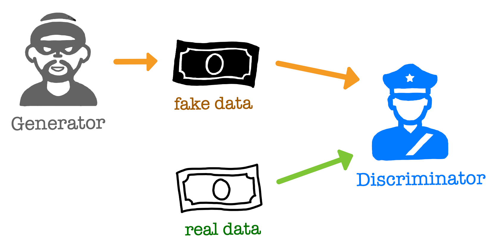
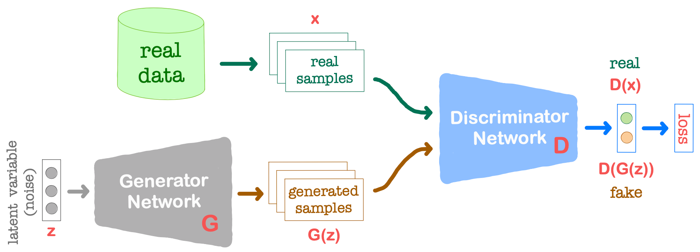
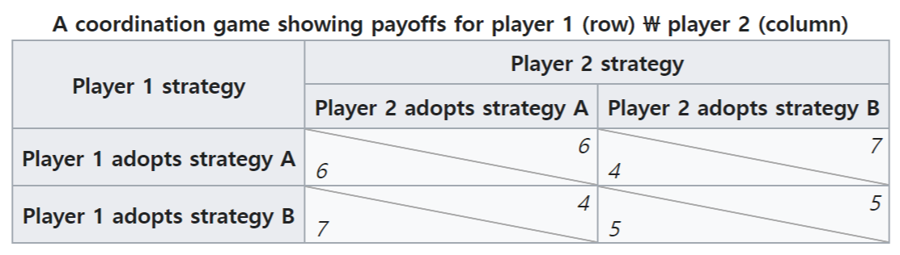
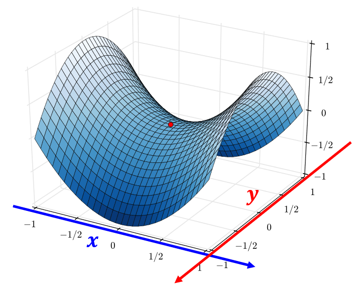

## 참고자료
* [1] [오승상 딥러닝 Deep Learning 38 GAN architecture 1](https://youtu.be/TYixl1I-QEo?si=XgR6m1LO1xJz6DfA)
* [2] [오승상 딥러닝 강의자료](https://sites.google.com/view/seungsangoh)

# Generative Adversarial Network (GAN)

{: width="80%" height="80%" class="align-center"}

 (image source : 오승상 딥러닝 강의자료 p.161) 

* Generative : 생성적
  * Learn a generative model
* Adversarial : 적대
  * Trained in an adversarial setting: generator G and discriminator D
  * generator : 데이터를 생성한다
  * discriminator : 생성된 데이터가 진짜 데이터와 얼마나 흡사한지 분별한다.
  * generator, discriminator은 서로 성능이 좋아지기 위해 경쟁/협동 한다.
* Network : 신경망
  * Use deep neural networks: raging from MLP, CNN, RNN to AE, DRL

VAE vs GAN
* VAE : input 데이터가 주어지면 input 데이터를 약간 변형시킨 데이터를 만들어냄
  * 새로운 데이터를 만들어내는 것이 목적이 아니라 새로운 알고리즘을 돌리고 싶을 때 데이터를 증강하기 위한 목적으로 주로 사용(유사한 데이터를 여러 개 만듬)
  * 각각 데이터에 약간의 변형을 줘서 만듬 따라서 새로운 데이터라고 하기 어렵다.
* GAN : 새로운 모습의 이미지를 만들어낸다.

## GAN architecture

{: width="80%" height="80%" class="align-center"}

 (image source : 오승상 딥러닝 강의자료 p.163) 

* Generator G : latent variable(noise)를 가져와서 generated(fake) sample을 만들어낸다.
  * real data의 분포와 같은 모습을 하도록 만드는 것이 목적이다.
  * Discriminator가 진짜 데이터로 착각하여 실수하도록 만든다.
* Discriminator D : real data에서 왔을 확률을 계산한다. 1에 가까울 수록 real data일 확률을 높게 예상한 것
* Generator, Discriminator 가 번갈아가며 반복적으로 학습하여 G, D의 성능을 높인다.
* 학습을 마친 후에는 Generator Network를 활용한다.
  * Discriminator는 Generator를 학습하기 위한 수단이다.

### Objective function

$$
\min_G \max_D L(D, G) = \mathbb{E}_{x \sim p_{\text{data}}(x)} \left[ \log D(x) \right] + \mathbb{E}_{z \sim p_z(z)} \left[ \log (1 - D(G(z))) \right]
$$

* 다른 학습의 경우 loss를 minimize하지만 GAN에서는 maximize 과정도 포함한다.
* $L(D,G)$ : $L(D, G) = \mathbb{E}_{x \sim p_{\text{data}}(x)} \left[ \log D(x) \right] + \mathbb{E}_{z \sim p_z(z)} \left[ \log (1 - D(G(z))) \right]$ 에 대해서 아래와 같은 연산을 수행하는 것이다. $\min_G \max_D L(D, G)$ 값이 우항과 같은 것이 아니다.
  * $\max_D$ : Discriminator에 대해서는 maximize
  * $\min_G$ : Generator에 대해서는 minimize
* $p_{\mathrm{data}(x)}$ : real data의 distribution
  * ${x \sim p_{\text{data}}(x)}$ : $x$가 real data라는 의미
  * 실제 구현시에는 minibatch 안의 dataset이 된다. (real data에서 sampling)
* $p_z(z)$ : generator가 어떤 데이터를 generate하기 위해 generator에 input으로 들어가는 latent variable을 말한다.
  * 간단한 분포로 uniform, normal distribution 이 된다.
* $G(z)$ : fake data
* $D(x)$ : discriminator에 들어간 real data, 1에 가까운 값을 출력할 수록 성능이 좋은 것이다.
* $D(G(z))$ : fake data이기 때문에 0에 가까운 값을 출력할 수록 좋은 것이다.
* 따라서 Discriminator 입장에서는 $L(D,G)$를 maximize해야 하는 것이다.
* Generator 입장에서는 $\mathbb{E}_{x \sim p_{\text{data}}(x)} \left[ \log D(x) \right]$ 부분은 generator부분이 없기 때문에 상관없고 $\mathbb{E}_{z \sim p_z(z)} \left[ \log (1 - D(G(z))) \right]$ 부분에서 Discriminator 부분이 착각하도록 유도해야 한다. 따라서 $D(G(z))$ 부분이 커지도록, 즉, $1-D(G(z))$ 부분이 작아지도록 해야 한다. 따라서 $\min_G$ 처럼 $L(D,G)$ 부분이 작아지도록 한다.

two-player minimax problem에서 solution은 Nash equilibrium과 같다고 알려져있다.

$$\text{Nash equilibrium: } p_{\mathrm{data}}=p_g \left(\text{ so, }D^{*}(x)=\frac{p_{\mathrm{data}}}{p_{\mathrm{data}} + p_g(x)} = \frac{1}{2} \text{ for all } x\right)$$

* Real data의 분포와 generator가 만들어낸 fake data가 만들어낸 데이터의 분포가 동일해질 때 Nash equilibrium이라고 한다. 이때가 globally optimal solution이다.
* $D^{*}$ : objective function을 maximize하는 optimal한 discriminator $D$
* Generator가 만들어낸 데이터가 각 데이터에 대해 real data라고 맞출 확률이 50%라는 것인데 이것은 무작위 확률과 같고 즉 구분이 가능하지 않다는 뜻이다.

## Nash equilibrium

다른 플레이어의 전략은 최적으로 고정되어있고 본인만 전략을 바꿀 수 있을때(unilaterally) 전략을 바꾼다고 해도 더 좋은 선택을 할 수 없을 때, 즉 본인이 변경 할 수 있는 것에 대해서는 optimal이다. 이렇게 플레이어가 모두 이 상태일때 Nash equilibrium이라고 한다.

{: width="80%" height="80%" class="align-center"}

 (image source : https://en.wikipedia.org/wiki/Nash_equilibrium) 

* 상대방의 전략을 모르는 상태(고정되어 있는 상태)일 때 나에게 선택권이 주어진다면 B를 선택할 것이다.
* 예를 들어 Player2가 A를 선택했다고 하자 그렇다면 Player1는 B가 좋기 때문에 B를 선택한다. 만약 Player2가 B를 선택한다면 똑같이 더 높은 점수를 얻는 B를 선택한다.
* 반대의 경우도 마찬가지이다.
* 결론적으로 (5, 5)의 보상을 얻게 된다.
* 각각의 플레이어는 각 입장에서 최적의 전략을 선택했지만 전체적으로는 suboptimal한 보상을 얻는다.

### Saddle model

{: width="80%" height="80%" class="align-center"}

 (By Nicoguaro - Own work, CC BY 3.0, https://commons.wikimedia.org/w/index.php?curid=20570051, Edited) 

$A, B$ 두 플레이어가 $x, y$를 조종하는데 $A, B$는 각각 $L(A, B) = x^2-y^2$ 를 최소/최대화하고 싶어 한다.

$$\min_A \min_B L(A,B) = x^2-y^2$$

* $A$입장에서는 $y$를 고정하면 아래로 볼록한 이차함수로 보인다.
* $B$입장에서는 $x$를 고정하면 위로 볼록한 이차함수로 보인다.
* 이 경우 unique nash equilibrium 은 $x=y=0$이다.