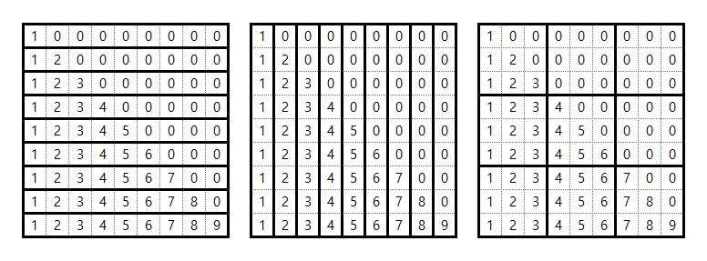
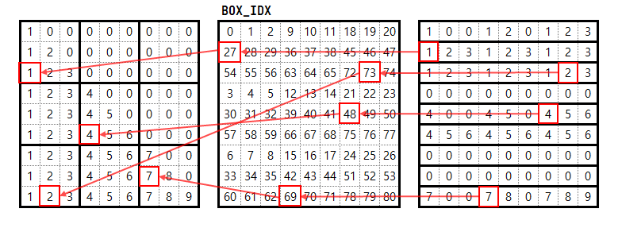

## 1.

`jnp.inner`과 `vmap`이 같이 활용되다보니 헷갈린 예시 (아래 예시는 최대한 간단히 재구성함)

`ndim`이 2인 두 행렬을 계산한다고 가정하자 예를 들어 아래와 같다.

```python
test1 = jnp.arange(0, 6).reshape(3, 2)  # (3, 2)
test2 = jnp.arange(1, 7).reshape(3, 2)  # (3, 2)
```

여기서 아래 두 연산은 `test1`, `test2`에 대해 동작한다.

1. `jnp.inner`
2. `jax.vmap(jnp.inner)`

하지만 결과는 각각 다르다.

```python
print(jnp.inner(test1, test2).shape)  # (3, 3)
print(jax.vmap(jnp.inner)(test1, test2).shape)  # (3,)
```

두번째 `jax.vmap(jnp.inner)`은 `axis`를 따로 설정하지 않을 경우 `axis=0`을 배치라고 생각하고 연산하기 때문에 `test1`, `test2`는 `axis=0` 축의 같은 인덱스에 있는 벡터끼리 `jnp.inner` 연산을 하는 것과 같다.

때문에 2번째 연산의 경우 `[ 2, 18, 50]` 의 결과가 나오는데 이것은

```
 test1   test2
[[0 1]  [[1 2]
 [2 3]   [3 4]
 [4 5]]  [5 6]]
```

위와 같은 연산에서

`[0*1 + 1*2, 2*3 + 3*4, 4*5 + 5 * 6]` 과 같다.

Einstein Summation Convention 으로 표현하면 각 연산은 다음과 같다.

아래 연산은 `a.shape == b.shape == (3, 2)` 를 기준으로 한다.
1. `jnp.inner` : `'ij,kj->ik'`
2. `jax.vmap(jnp.inner)` : `'ij,ij->i'`

## 2. `vmap`의 2차원 활용

어떤 2차원 배열이 있을 때 axis=0(행) 과 axis=1(열) 의 각 axis의 index에 의존한 연산을 하고싶을 때는 어떻게 해야 할까

먼저 인덱스부터 얻어보자 5 x 4 배열의 모든 요소의 인덱스를 얻고 싶다면

(0, 0), (0, 1), ..., (4, 3) 까지 모두 25개로 일반화하면 행의 개수와 열의 개수를 곱한 개수만큼의 인덱스가 필요할 것이다.

그렇다면 다음과 같이 인덱스를 얻을 수도 있다.

```python
ROW = 5
COL = 4

indices = jnp.arange(ROW * COL)

row_indices, col_indices = jnp.divmod(indices, COL)

print(row_indices)
print(col_indices)
# [0 0 0 0 1 1 1 1 2 2 2 2 3 3 3 3 4 4 4 4]
# [0 1 2 3 0 1 2 3 0 1 2 3 0 1 2 3 0 1 2 3]
```

그럼 아래와 같이 활용할 수 있다.

```python
data = jnp.arange(ROW * COL).reshape(ROW, COL)
print(data)
# [[ 0  1  2  3]
#  [ 4  5  6  7]
#  [ 8  9 10 11]
#  [12 13 14 15]
#  [16 17 18 19]]

result = jax.vmap(lambda x, y: data[x, y])(row_indices, col_indices)
result = result.reshape(ROW, COL)
print(result)
# [[ 0  1  2  3]
#  [ 4  5  6  7]
#  [ 8  9 10 11]
#  [12 13 14 15]
#  [16 17 18 19]]
```
하지만 위의 경우 두 가지 단점이 있다.
1. `reshape` 과정이 동반되는 것
2. 각 축의 요소를 곱한 만큼의 인덱스가 필요하다, 예를 들어 ROW=$r$, COL=$c$ 일 경우 $2 \times r \times c$ 의 인덱스가 필요하다. 
   * $\prod_i^k n(i)$
     * $k$ : dimension(`ndim`)
     * $n(i)$ : $i$ 축의 길이(`len`)

그렇다면 2차원을 2차원답게 활용하려면 어떻게 해야 할까

결론부터 말하면 다음과 같다. 

```python
ROW = 5
COL = 4

r_indices = jnp.arange(ROW)
c_indices = jnp.arange(COL)

result = jax.vmap(jax.vmap(lambda x, y: data[x,y], in_axes=(None, 0)), in_axes=(0, None))(r_indices, c_indices)
print(result)
# [[ 0  1  2  3]
#  [ 4  5  6  7]
#  [ 8  9 10 11]
#  [12 13 14 15]
#  [16 17 18 19]]
```

다르게 활용하고 싶다면 함수를 `(r, c, ...)`의 파라미터를 받는 다른 함수로 바꾸면 된다.

자세한 동작원리와 주의할 점은 아래에서 서술한다.

## 2.1. #2의 동작원리와 주의할 점

우리가 주목해야 할 부분은 아래 코드이다. 안부터 자세히 뜯어보자

```python
jax.vmap(jax.vmap(lambda x, y: data[x,y], in_axes=(None, 0)), in_axes=(0, None))(r_indices, c_indices)
```

일단 맨 바깥의 함수는 `in_axes=(0, None)`이다. 그러면 첫 인자는 axis=0를 탐색하여 축의 각 요소마다 할당된 요소를 사용하겠다는 뜻이다. 두번째 `None`은 병렬된 축에 걸쳐 모든 요소를 활용하겠다는 뜻이다. 병렬 처리된 개수는 처음 `r_indices.shape[0] == 5`를 따를 것이다.

따라서 그 안에 있는 `in_axes=(None, 0)` 으로 정의된 `vmap` 함수에는 각 인자가 다음과 같이 (`vmap` 되어) 들어갈 것이다.


```
(0, [0, 1, 2, 3])
(1, [0, 1, 2, 3])
(2, [0, 1, 2, 3])
(3, [0, 1, 2, 3])
(4, [0, 1, 2, 3])
```

이제 감이 올 것이다. 이제 이것은

```python
jax.vmap(lambda x, y: data[x,y], in_axes=(None, 0))
```

이 함수로 들어갈 것인데 0축은 `None`으로 고정이고 1축은 `0`을 가지므로 두번째 인자의 0번째 축을 기준으로 `vmap`이 적용된다.

```
(0, [0, 1, 2, 3]) -> (0, 0), (0, 1), (0, 2), (0, 3)
(1, [0, 1, 2, 3]) -> (1, 0), (1, 1), (1, 2), (1, 3)
(2, [0, 1, 2, 3]) -> (2, 0), (2, 1), (2, 2), (2, 3)
(3, [0, 1, 2, 3]) -> (3, 0), (3, 1), (3, 2), (3, 3)
(4, [0, 1, 2, 3]) -> (4, 0), (4, 1), (4, 2), (4, 3)
```

이러면 이제 각 축의 길이만을 사용하여 모든 요소에 접근하는 방법을 알았다. 처음 접근법과 달리 `flatten` 이나 `reshape` 할 필요도 없고 인덱스를 모두 구할 필요도 없다.

**주의할 점**

`in_axes` 의 순서에 주의해야 한다. 예를 들어

```python
jax.vmap(jax.vmap(lambda x, y: data[x,y], in_axes=(0, None)), in_axes=(None, 0))(r_indices, c_indices)
```

위와 같이 `in_axes`의 순서를 바꾸면 인자가 다음과 같이 들어가게 된다.


```
([0, 1, 2, 3, 4], 0) -> (0, 0), (1, 0), (2, 0), (3, 0), (4, 0)
([0, 1, 2, 3, 4], 1) -> (0, 1), (1, 1), (2, 1), (3, 1), (4, 1)
([0, 1, 2, 3, 4], 2) -> (0, 2), (1, 2), (2, 2), (3, 2), (4, 2)
([0, 1, 2, 3, 4], 3) -> (0, 3), (1, 3), (2, 3), (3, 3), (4, 3)
```

그러면 결과가 다음과 같이 나올 것이다.

```
[[ 0  4  8 12 16]
 [ 1  5  9 13 17]
 [ 2  6 10 14 18]
 [ 3  7 11 15 19]]
```


즉 transpose된 결과가 나오게 된다. 따라서 `vmap`을 겹쳐서 사용할 때는 `in_axes`의 순서에 주의해야 한다.

## 3. 조건에 따라 `fori_loop`, `while_loop` 활용하기

내가 하고싶은 것은 다음과 같았다.

만약 음이 아닌 정수가 주어질 경우 `fori_loop`을 사용하고 해당 횟수만큼 반복한다. 아니면 `None`이 주어질 경우 `cond_fun`이 `False`가 될 때까지 `while_loop`을 반복한다.

그런데 내 문제는 다음과 같았다 [`fori_loop`](https://jax.readthedocs.io/en/latest/_autosummary/jax.lax.fori_loop.html)와 [`while_loop`](https://jax.readthedocs.io/en/latest/_autosummary/jax.lax.while_loop.html)의 문서를 보면


```python
def fori_loop(lower, upper, body_fun, init_val):
  val = init_val
  for i in range(lower, upper):
    val = body_fun(i, val)
  return val
```

```python
def while_loop(cond_fun, body_fun, init_val):
  val = init_val
  while cond_fun(val):
    val = body_fun(val)
  return val
```

`body_fun`을 보면 둘의 모양이 다르다.
* `while_loop` : `body_fun`은 `val`을 받아서 `val`을 반환한다.
* `fori_loop` : `body_fun`은 `i`, `val`을 받아서 `val`을 반환한다.

이는 같은 `body_fun`을 두 함수에 사용할 수 없다는 뜻이다. 그렇다고 업데이트 함수를 두 개를 만들 수는 없었다. 나의 경우 반복만 하면 되고 `i`가 필요하지 않았기 때문에 `body_fun(val)` 형태만 사용하면 되었다. 

이럴 경우에는 `body_fun`을 wrapping하는 함수를 만들어서 사용하면 된다. 기본 구조는 다음과 같다. 나의 경우는 `i`를 사용하지 않는 것이 자명했기 때문에 `del i` 를 했지만 본인이 원하고 싶은 대로 활용해도 된다.

```python
def body_fun_fori(i, values):
    del i
    return body_fun(values)
```

예시는 다음과 같다.

```python
def body_fun(x):
    return x + 1

def cond_fun(x):
    return x < 7

def body_fun_fori(i, x):
    return body_fun(x)
```

```python
def get_result(number):
    if number is None:
        result = jax.lax.while_loop(cond_fun, body_fun, init_val)
    else:
        result = jax.lax.fori_loop(0, number, body_fun_fori, init_val)
    return result
```

하지만 위 `get_result`는 `jit`할 수 없다. `jit` 하기 위해서는 다음과 같은 방법이 가능할 것이다.

```python
@jax.jit
def get_result(number):
    return jax.lax.select(number > 0, 
                          jax.lax.fori_loop(0, number, body_fun_fori, init_val), 
                          jax.lax.while_loop(cond_fun, body_fun, init_val))

get_result(-1)
# Array(7, dtype=int32, weak_type=True)
get_result(100)
# Array(100, dtype=int32, weak_type=True)
```

사전에 `None`을 음수로 바꾸거나 설계자체를 바꿔버릴 수도 있다.

그럼 다음과 같이 `None`을 조건으로 하면 안될까?

```python
jax.lax.select(number is not None, 
                          jax.lax.fori_loop(0, number, body_fun_fori, init_val), 
                          jax.lax.while_loop(cond_fun, body_fun, init_val))
```

이에 대해서는 4.에서 다룬다.


## 4. `jax.lax.select` 주의점

다음과 같은 코드가 있다 하자. 이는 [**3. 조건에 따라...**](#3-조건에-따라-fori_loop-while_loop-활용하기) 의 마지막 부분을 설명하기 위해 간소화된 코드이다.

```python
def get3():
    return 3

def hate_none(v):
    if v is None:
        raise ValueError(f"ERROR!: {v}.")
    return v

@jax.jit
def test_none(x):
    result = jax.lax.select(x is None, get3(), hate_none(x))
    return result
```

`hate_none`은 `None`이 들어오면 에러를 발생시키는 함수이다.

`test_none` 함수를 보면 `x`가 `None`이면 `get3()`을 실행하고 아니면 `hate_none(x)`를 실행한다.

그럼 우리의 직관상 `x`가 `None`일 경우 `get3()`이 실행되기 때문에 해당 함수는 오류가 일어나지 않을 것 처럼 보인다. 하지만 다음 결과를 보자.

```python
test_none(5)
# Array(5, dtype=int32, weak_type=True)
test_none(None)
# <ipython-input-96-ce2f69b2d9fb> in hate_none(v)
#       5 def hate_none(v):
#       6     if v is None:
# ----> 7         raise ValueError(f"ERROR!: {v}.")
#       8     return v
```

오류가 난다, 왜일까? 우리는 어떠한 경우에도 `hate_none`이 실행될 수 없도록 함수를 짰다. 이는 공식문서를 보면 답이 나온다.

[**`jax.lax.select`**](https://jax.readthedocs.io/en/latest/_autosummary/jax.lax.select.html)

> **In general `select()` leads to evaluation of both branches, although the compiler may elide computations if possible.** For a similar function that usually evaluates only a single branch, see `cond()`.

위와 같이 `jax.lax.select`는 실행 전에 두 branch를 모두 평가한다. 따라서 `hate_none`에 `None`이 들어가면서 에러가 발생한 것이다.

여기서 헷갈리면 안되는 것 이 있다.

**함수에 `None`을 넣으면 안되는 것**이 아니라, `None`을 넣으면 안되는 함수에 들어갈 수 없다는 것이다.

```python
jax.lax.select(number is not None, 
                          jax.lax.fori_loop(0, number, body_fun_fori, init_val), 
                          jax.lax.while_loop(cond_fun, body_fun, init_val))
```

이 이 예시가 안되는 이유는 `number`가 `jax.lax.fori_loop`에 들어가면서 에러가 생기는 것이다. 해당 부분은 `jax.lax.fori_loop(lower, upper, body_fun, init_val, *, unroll=None)` 의 `upper` 부분에 해당하는 데 자세히는 서술하지 않겠지만 함수 내부에서 `lower`, `upper`이 `None`인지 여부를 검사하여 에러를 발생시킨다.

따라서 다음 코드는 에러가 발생하지 않는다.

```python
def get3():
    return 3

def get5():
    return 5

@jax.jit
def test_none(x):
    result = jax.lax.select(x is None, get3(), get5())
    return result

test_none(5)
# Array(5, dtype=int32, weak_type=True)
test_none(None)
# Array(3, dtype=int32, weak_type=True)
```

---

> For a similar function that usually evaluates only a single branch, see `cond()`.

부분에 대해서

```python
def get3(x):
    return 3

def get2(x):
    if x is None:
        raise ValueError(f"ERROR!: {x}.")
    return 2

@jax.jit
def test_none_cond(x):
    result = jax.lax.cond(x is None, get3, get2, x)
    return result
```

```python
test_none_cond(None)
```
를 실행하면 `get2` 가 평가되지 않아 에러가 안나는 것인가 생각했으나 오류가 났다.

```python
<ipython-input-23-d118fa32b86b> in get2(x)
      4 def get2(x):
      5     if x is None:
----> 6         raise ValueError(f"ERROR!: {x}.")
      7     return 2
```

---

## 5. 격자공간 다루기

{: width="80%" height="80%" class="align-center"}

9 X 9 격자를 다루는 상황에서 위의 각 묶여진 셀들에 대해 연산을 하고싶다고 하자, 각 묶여진 공간끼리는 독립적이므로 `vmap`을 사용하는 것이 유리할 것이다.

여기서는 연산을 `jnp.sum`이라고 하자. (물론 `jnp.sum`은 `axis`를 통해 행, 열 방향으로 `sum`을 할 수 있지만 여기서는 그런 함수가 아니라 가정하자, 물론 `jnp.sum`으로도 3번째 예시를 한번에 구하는 방법은 없다.)

일단 첫번째 예시는 쉽게 구할 수 있을 것이다.

```python
array = jnp.array([
    [1, 0, 0, 0, 0, 0, 0, 0, 0],
    [1, 2, 0, 0, 0, 0, 0, 0, 0],
    [1, 2, 3, 0, 0, 0, 0, 0, 0],
    [1, 2, 3, 4, 0, 0, 0, 0, 0],
    [1, 2, 3, 4, 5, 0, 0, 0, 0],
    [1, 2, 3, 4, 5, 6, 0, 0, 0],
    [1, 2, 3, 4, 5, 6, 7, 0, 0],
    [1, 2, 3, 4, 5, 6, 7, 8, 0],
    [1, 2, 3, 4, 5, 6, 7, 8, 9]
])
```

```python
jax.vmap(jnp.sum)(array)
# Array([ 1,  3,  6, 10, 15, 21, 28, 36, 45], dtype=int32)
```

그렇다면 두번째는 어떨까? 두번째는 행렬을 traspose하면 될 것이다. 혹은 `in_axes=1`로 하는 방법도 있다.

```python
jax.vmap(jnp.sum)(array.T)
# Array([ 9, 16, 21, 24, 25, 24, 21, 16,  9], dtype=int32)
jax.vmap(jnp.sum, in_axes=1)(array)
# Array([ 9, 16, 21, 24, 25, 24, 21, 16,  9], dtype=int32)
```

세번째는 어떨까, 방법이 바로 떠오르지 않을 것이다. 방법을 찾아보면, 우리는 앞의 두 예시에서 우리가 연산하기를 원하는 범위를 `vmap`의 `in_axes` (보통 0) 에 해당하는 축의 각 요소로 넣어주었다. 즉 아래와 같다.

* `in_axes=0` : 각 행(axis=0)이 내가 연산하기 원하는 요소가 된다.
* `in_axes=1` : 각 열(axis=1)이 내가 연산하기 원하는 요소가 된다.

그렇다면 세번째는 어떻게 하면 될까? `jnp.take`를 활용하면 된다. `jnp.take`는 다음과 같다.

```python
jax.numpy.take(a, indices, axis=None, ...)
```
> Take elements from an array.

indices는 인덱스를 가지는 배열이고, 인덱스의 해당 위치에는 `i`라고 적혀있다고 하면 해당 위치의 값은 `a[i]` 이다.

그렇면 다음과 같은 하드코딩을 통해 `vmap`을 활용할 수 있다. [`jumanji`의 코드](https://github.com/instadeepai/jumanji/blob/fd511b4523425bdcc69f2fd3c8869cefddd49f1d/jumanji/environments/logic/sudoku/constants.py#L20C1-L32C2)를 참고하였다.

```python
# jumanji/environments/logic/sudoku/constants.py
BOX_IDX = np.array(
    [
        [0, 1, 2, 9, 10, 11, 18, 19, 20],
        [27, 28, 29, 36, 37, 38, 45, 46, 47],
        [54, 55, 56, 63, 64, 65, 72, 73, 74],
        [3, 4, 5, 12, 13, 14, 21, 22, 23],
        [30, 31, 32, 39, 40, 41, 48, 49, 50],
        [57, 58, 59, 66, 67, 68, 75, 76, 77],
        [6, 7, 8, 15, 16, 17, 24, 25, 26],
        [33, 34, 35, 42, 43, 44, 51, 52, 53],
        [60, 61, 62, 69, 70, 71, 78, 79, 80],
    ]
)
```

그러면 다음과 같이 매핑된다.

{: width="80%" height="80%" class="align-center"}

```python
jnp.take(array, jnp.asarray(BOX_IDX))
# Array([[1, 0, 0, 1, 2, 0, 1, 2, 3],
#        [1, 2, 3, 1, 2, 3, 1, 2, 3],
#        [1, 2, 3, 1, 2, 3, 1, 2, 3],
#        [0, 0, 0, 0, 0, 0, 0, 0, 0],
#        [4, 0, 0, 4, 5, 0, 4, 5, 6],
#        [4, 5, 6, 4, 5, 6, 4, 5, 6],
#        [0, 0, 0, 0, 0, 0, 0, 0, 0],
#        [0, 0, 0, 0, 0, 0, 0, 0, 0],
#        [7, 0, 0, 7, 8, 0, 7, 8, 9]], dtype=int32)
```

맨 오른쪽 격자의 맨 윗줄이 맨 왼쪽의 격자의 맨 왼쪽 위의 3 X 3 격자에 매핑되는 것을 쉽게 확인할 수 있을 것이다.

이러면 각 공간별로 `vmap`을 적용할 수 있다.

다시 원래대로 돌리는 index를 구하려면 `jnp.argsort(BOX_IDX.flatten()).reshape(9, 9)`를 사용하면 된다.

```python
import numpy as np
import jax.numpy as jnp

array = jnp.array([
    [1, 0, 0, 0, 0, 0, 0, 0, 0],
    [1, 2, 0, 0, 0, 0, 0, 0, 0],
    [1, 2, 3, 0, 0, 0, 0, 0, 0],
    [1, 2, 3, 4, 0, 0, 0, 0, 0],
    [1, 2, 3, 4, 5, 0, 0, 0, 0],
    [1, 2, 3, 4, 5, 6, 0, 0, 0],
    [1, 2, 3, 4, 5, 6, 7, 0, 0],
    [1, 2, 3, 4, 5, 6, 7, 8, 0],
    [1, 2, 3, 4, 5, 6, 7, 8, 9]
])

BOX_IDX = jnp.array(
    [
        [0, 1, 2, 9, 10, 11, 18, 19, 20],
        [27, 28, 29, 36, 37, 38, 45, 46, 47],
        [54, 55, 56, 63, 64, 65, 72, 73, 74],
        [3, 4, 5, 12, 13, 14, 21, 22, 23],
        [30, 31, 32, 39, 40, 41, 48, 49, 50],
        [57, 58, 59, 66, 67, 68, 75, 76, 77],
        [6, 7, 8, 15, 16, 17, 24, 25, 26],
        [33, 34, 35, 42, 43, 44, 51, 52, 53],
        [60, 61, 62, 69, 70, 71, 78, 79, 80],
    ]
)

inverse_map = jnp.argsort(BOX_IDX.flatten()).reshape(9, 9)

array2 = jnp.take(array, BOX_IDX)
array3 = jnp.take(array2, inverse_map)

print(jnp.all(array == array3))
# True
```

참고로 아래 배열은 똑같이 3 X 3 공간에 대해 연산하는데도 불구하고, 변환 배열과 역변환 하는 배열이 같다. (위의 예시는 각 3 X 3 덩어리 9개라고 생각했을 때 (0, 0), (1, 0), (2, 0), (1, 0), ..., (2, 2) 순서로 각 행에 배치되지만 아래는 (0, 0), (0, 1), (0, 2), (1, 0), ..., (2, 2) 순서로 배치된다.)

```python
BOX_IDX = jnp.array(
    [
        [0, 1, 2, 9, 10, 11, 18, 19, 20],
        [3, 4, 5, 12, 13, 14, 21, 22, 23],
        [6, 7, 8, 15, 16, 17, 24, 25, 26],
        [27, 28, 29, 36, 37, 38, 45, 46, 47],
        [30, 31, 32, 39, 40, 41, 48, 49, 50],
        [33, 34, 35, 42, 43, 44, 51, 52, 53],
        [54, 55, 56, 63, 64, 65, 72, 73, 74],
        [57, 58, 59, 66, 67, 68, 75, 76, 77],
        [60, 61, 62, 69, 70, 71, 78, 79, 80],
    ]
)

inverse_idx = jnp.argsort(BOX_IDX.flatten()).reshape(9, 9)
jnp.all(BOX_IDX == inverse_idx)
# Array(True, dtype=bool)
```